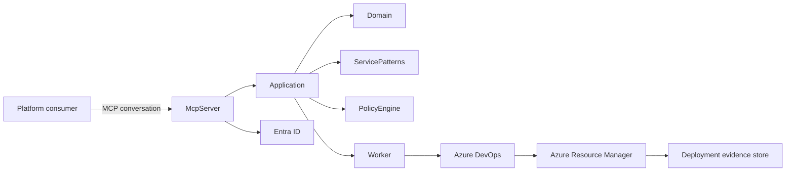

# Azure Mission Workspace

Azure Mission Workspace is a **governed infrastructure fulfillment platform** exposed through the
Model Context Protocol (MCP). It lets users who are unfamiliar with Azure request approved Azure
capabilities through natural-language conversation, while every authorization, policy, and
deployment decision remains under deterministic, server-side control.

> Azure Mission Workspace is a starter framework, not a certified compliance product. It provides
> controls and evidence that can support an organization's own compliance process; it does not
> claim FedRAMP, DoD IL, NIST, or any other certification.

## Product purpose

The system converts a conversational request into a structured `DeploymentRequest`, recommends an
**approved service pattern**, collects and validates only the inputs allowed by that pattern,
renders a deterministic Bicep parameter file, validates the approved Bicep modules, produces an ARM
what-if plan, evaluates policy, calculates risk and approval requirements, and — only after
approval — executes the deployment through an Azure DevOps pipeline. Every step is recorded as
immutable **deployment evidence**.

The AI is a guided front door to a controlled catalog of approved Azure service patterns. It is
**not** authorized to generate arbitrary Bicep, execute Azure CLI/PowerShell commands, or bypass
policy and approval controls. See [`docs/threat-model.md`](docs/threat-model.md) for the full threat
model.

## Security boundary

- The language model may **recommend and explain**. It never makes the final authorization, policy,
  approval, or deployment decision — those are enforced server-side in the Application, PolicyEngine,
  and Azure DevOps layers.
- All MCP tool authorization is enforced with ASP.NET Core policy-based authorization bound to
  Entra ID identities. Prompt text and MCP tool annotations are documentation, never security
  controls.
- Human actor identity is preserved end-to-end. The Azure DevOps service connection or managed
  identity that performs the technical deployment never replaces the human actor in the audit
  model.
- Secret values are never written to generated parameter files, logs, pull-request descriptions,
  evidence files, or chat responses — only Key Vault secret identifiers or pipeline secret variable
  references are used.

Full details: [`docs/security-model.md`](docs/security-model.md) (identity, authorization roles,
separation of duties, secret handling, trust boundaries) and
[`docs/threat-model.md`](docs/threat-model.md).

## Architecture overview

Azure Mission Workspace is built as a **modular monolith**. See
[`docs/architecture.md`](docs/architecture.md) for the full system-context and component diagrams.
The condensed picture:



The deployment-request state machine and the validation/deployment sequence are documented (with
Mermaid diagrams) in [`docs/deployment-lifecycle.md`](docs/deployment-lifecycle.md); trust
boundaries are diagrammed in [`docs/security-model.md`](docs/security-model.md#trust-boundaries).

Architecture decisions are captured as ADRs in [`docs/adr/`](docs/adr/), including the modular
monolith (ADR-001), Bicep as the infrastructure language (ADR-002), approved service patterns
instead of arbitrary generation (ADR-003), Azure DevOps as the deployment executor (ADR-004), ARM
what-if as the planning gate (ADR-005), MCP as the primary interface (ADR-006), human identity
preservation (ADR-007), and standard deployment vs. Deployment Stacks (ADR-008).

## Prerequisites

- [.NET 10 SDK](https://dotnet.microsoft.com/download) (pinned via `global.json`)
- No Azure subscription, Azure DevOps organization, or Entra ID tenant is required to build, test,
  or run the local sample — the development configuration uses in-memory persistence and fake
  Azure DevOps/Resource Manager adapters.

## Local setup

```bash
dotnet restore AzureMissionWorkspace.sln
dotnet build AzureMissionWorkspace.sln
dotnet test AzureMissionWorkspace.sln

# Run the MCP server (Development environment: fake authenticated actor, file-system catalog, fake ADO/ARM)
dotnet run --project src/AzureMissionWorkspace.McpServer

# Run the background Worker (pipeline reconciliation, approval expiration, evidence finalization)
dotnet run --project src/AzureMissionWorkspace.Worker
```

In the `Development` environment (`ASPNETCORE_ENVIRONMENT=Development`), `appsettings.Development.json`
sets `Authentication:UseFakeActor=true`, which installs a fake authentication handler that stands in
for an Entra ID-authenticated `PlatformEngineer`/`DeploymentRequestor`/`DeploymentApprover` — no
token is required. Once running, the MCP server exposes:

- `GET /health` — liveness
- `GET /ready` — readiness (includes a service-pattern catalog health check)
- `GET /.well-known/mcp-server-metadata` — MCP transport/authentication metadata
- `POST /mcp` — the MCP endpoint (HTTP transport)
- `GET /audit/correlation/{correlationId}` — authorized diagnostics for a given correlation ID

## Solution structure

```
AzureMissionWorkspace.sln
src/
  AzureMissionWorkspace.Domain           # Entities, value objects, enums, state machine, domain exceptions. No Azure/MCP/persistence dependencies.
  AzureMissionWorkspace.Application      # Use cases, handlers, validators, authorization requirements, abstractions (repositories, Bicep, Azure DevOps, ARM).
  AzureMissionWorkspace.ServicePatterns  # Catalog loading, descriptor parsing/validation, version resolution, parameter rendering.
  AzureMissionWorkspace.PolicyEngine     # Deterministic policy rules, evaluator, catalog, result normalizer.
  AzureMissionWorkspace.Infrastructure   # In-memory repositories, fake Bicep/ARM/Azure DevOps adapters, evidence builder, telemetry wiring.
  AzureMissionWorkspace.McpServer        # MCP tool/resource/prompt registration, auth, health checks, HTTP transport host.
  AzureMissionWorkspace.Worker           # Pipeline reconciliation, approval expiration, evidence finalization background services.
tests/
  AzureMissionWorkspace.Domain.Tests
  AzureMissionWorkspace.Application.Tests
  AzureMissionWorkspace.PolicyEngine.Tests
  AzureMissionWorkspace.IntegrationTests
  AzureMissionWorkspace.ArchitectureTests
service-patterns/       # internal-web-api, internal-web-app, storage-account, key-vault
bicep/                  # modules/, orchestration/, shared/, configuration/
environment-profiles/   # azure-commercial-development, azure-commercial-test, azure-government-development, azure-government-test
pipelines/              # Azure DevOps validation/deployment pipeline templates
schemas/                # JSON Schemas for deployment-request, service-pattern, environment-profile, policy-result, deployment-evidence
docs/                   # architecture, security-model, threat-model, service-pattern-authoring, deployment-lifecycle, adr/
```

## MCP tool catalog

Every tool declares whether it is read-only, mutating, approval-sensitive, or
deployment-triggering via its description and MCP annotations (`readOnlyHint`/`destructiveHint`/
`idempotentHint`) — but authorization is always enforced server-side regardless of these
annotations.

| Tool | Kind |
|---|---|
| `list_service_patterns` | Read-only |
| `get_service_pattern` | Read-only |
| `recommend_service_pattern` | Read-only (LLM-assisted recommendation, not authoritative) |
| `get_required_inputs` | Read-only |
| `create_deployment_request` | Mutating |
| `get_deployment_request` | Read-only |
| `update_deployment_request` | Mutating |
| `select_service_pattern` | Mutating |
| `validate_deployment_request` | Mutating (runs schema/application validation) |
| `cancel_deployment_request` | Mutating, destructive (cancels the request) |
| `generate_deployment_plan` | Mutating (invokes template validation + ARM what-if) |
| `get_deployment_plan` | Read-only |
| `explain_deployment_plan` | Read-only (explanation only; never the authoritative risk value) |
| `evaluate_policy_compliance` | Mutating (runs the policy engine) |
| `get_policy_findings` | Read-only |
| `explain_policy_finding` | Read-only |
| `submit_deployment_for_approval` | Mutating, approval-sensitive |
| `record_approval_decision` | Mutating, approval-sensitive |
| `queue_deployment` | Mutating, deployment-triggering, destructive |
| `get_deployment_status` | Read-only |
| `get_deployment_evidence` | Read-only |

MCP resources (read-only): `mission-workspace://service-patterns/{id}/{version}`,
`mission-workspace://deployment-requests/{id}`, `mission-workspace://deployment-plans/{id}`,
`mission-workspace://deployment-evidence/{id}`, `mission-workspace://environment-profiles/{id}`.

MCP prompts: `start_deployment_request`, `explain_deployment_plan`, `resolve_policy_findings`,
`troubleshoot_failed_deployment`.

The platform deliberately does **not** expose `run_bicep`, `run_azure_cli`, `execute_command`,
`deploy_arbitrary_resource`, `generate_unrestricted_bicep`, `bypass_policy`, or
`approve_own_request` — these are explicit non-goals (see [Non-goals](#non-goals)).

## Service-pattern authoring

Each service pattern is a versioned, approved directory under `service-patterns/<id>/` containing
`service-pattern.yaml`, `input-schema.json`, `main.bicep`, `main.bicepparam`, `README.md`, and
`tests/`. The starter catalog ships four patterns: `internal-web-api`, `internal-web-app`,
`storage-account`, and `key-vault` — safe starter templates, not claims of universal production
readiness. See [`docs/service-pattern-authoring.md`](docs/service-pattern-authoring.md) for the
full authoring guide (descriptor schema, secure defaults, module pinning, secret-input handling).

## Example conversation

```
User: I need a small internal API that only my team can reach, in our development subscription.
Assistant: That sounds like the "internal-web-api" service pattern (App Service + managed identity,
           public network access disabled). I can use environment profile
           "azure-commercial-development". I need: app name, allowed inbound subnet, and a data
           classification. Anything containing secrets (like a database connection string) should
           be provided as a Key Vault secret reference, not as plain text.
User: App name "claims-intake", subnet "snet-apps-dev-01", classification "Internal".
Assistant: [create_deployment_request → select_service_pattern → update_deployment_request →
           validate_deployment_request] Inputs are valid. Generating the deployment plan...
           [generate_deployment_plan → evaluate_policy_compliance] What-if shows 4 resources will
           be created, 0 modified, 0 deleted. Policy evaluation found no blocking findings. This is
           a Create-only change in a development environment, so it qualifies for the lower
           approval tier. Submitting for approval.
User: (approver) Approved.
Assistant: [record_approval_decision → queue_deployment] Deployment queued to Azure DevOps
           (correlation id ...). I will report status and evidence once the pipeline completes.
```

## Validation lifecycle

1. Descriptor and JSON-Schema validation of the deployment request's inputs.
2. Deterministic `.bicepparam` rendering (no secret values embedded).
3. Bicep format check, build, and lint using the pinned Bicep CLI and `bicepconfig.json`.
4. ARM template validation and what-if at the pattern's declared scope.
5. Normalization of the raw what-if result into `Create`/`Modify`/`Delete`/`Replace`/`NoChange`/
   `Ignore`/`Unknown`, with the raw result preserved in evidence.
6. Deterministic policy evaluation of both the request and the normalized plan.
7. Deterministic risk calculation (delete/replace = high risk; unknown = review required; changes
   to auth/policy/network/Key Vault/production resources require elevated review).

See [`docs/deployment-lifecycle.md`](docs/deployment-lifecycle.md) for the full state diagram and
sequence diagram.

## Approval lifecycle

Approval requirements are calculated deterministically from environment type, data classification,
and risk. A requestor can never approve their own protected-environment deployment (enforced
server-side, not by convention). Approvals that sit unattended in `AwaitingApproval` beyond a
configurable timeout are automatically expired by the Worker's `ApprovalExpirationService` — this
is a time-based system transition, never a policy bypass or an implicit approval.

## Azure DevOps integration

`IAzureDevOpsClient` (with `IRepositoryService`, `IPullRequestService`, `IPipelineService`,
`IApprovalService`, `IArtifactService`) abstracts creating/reusing a deployment branch, committing
generated non-secret parameter artifacts, opening a pull request (populated with the deployment
request ID, requestor identity, service-pattern ID/version, environment-profile ID, target scope,
risk classification, policy summary, what-if artifact reference, and approval requirements),
queuing validation/deployment pipelines, and retrieving status/artifacts. The starter ships a
deterministic `FakeAzureDevOpsClient` so the local sample never requires a real Azure DevOps
organization. Pipeline YAML templates live under [`pipelines/`](pipelines/).

The Worker's `PipelineStatusReconciliationService` polls `IPipelineService.GetStatusAsync` for
in-flight deployments and transitions the deployment request through
`DeploymentQueued → Deploying → Deployed/DeploymentFailed`, then hands off to evidence
finalization.

## Azure Government considerations

`IServiceAvailabilityProvider` returns an indeterminate/unsupported result whenever compatibility
of a service, SKU, API version, Azure Policy definition, or Azure Verified Module cannot be
verified for the target cloud — the platform never assumes feature parity between Azure Commercial
and Azure Government. Example environment profiles are provided for both clouds:
`azure-government-development` and `azure-government-test` alongside their commercial counterparts,
under [`environment-profiles/`](environment-profiles/).

## Testing

```bash
dotnet test AzureMissionWorkspace.sln
```

- **Domain.Tests** — legal/illegal state transitions, concurrency protection.
- **Application.Tests** — handlers, validators, deterministic parameter rendering, secret
  redaction.
- **PolicyEngine.Tests** — allowed-region, required-tag, approved-module, pinned-version,
  public-network, destructive-change, and separation-of-duties rules; policy-catalog composition.
- **IntegrationTests** — end-to-end workflow using fake Azure DevOps/ARM adapters; what-if
  normalization fixtures for create-only, safe modification, deletion, replacement, unknown-change,
  and no-change scenarios.
- **ArchitectureTests** — enforce that Domain has no dependency on Azure/MCP/Azure DevOps SDKs or
  persistence frameworks, and that McpServer delegates to Application rather than embedding
  business logic.

No test requires an Azure subscription, Azure DevOps organization, or network access.

## Known starter limitations

- Persistence is in-memory only; it is designed so Azure Cosmos DB, Azure SQL, or another store can
  be added later without changing the Domain layer, but no such implementation ships in the
  starter.
- Azure DevOps and Azure Resource Manager adapters are deterministic fakes; real
  `Azure.ResourceManager`/Azure DevOps REST integrations are not implemented.
- `PipelineExecution` state is tracked in an in-memory `IPipelineExecutionTracker` shared between
  the MCP server and the Worker rather than a persisted repository.
- The evidence package assembled by the Worker in this starter is a representative subset (request,
  redacted parameters, pipeline execution, and deployment result) rather than the full 16-artifact
  set described in the evidence model — what-if/policy/source-revision artifacts are produced
  earlier in the pipeline and are not yet wired into the same evidence package.
- `IIntentExtractionService` and `IPatternRecommendationService` use deterministic, non-AI fake
  implementations suitable for local development and tests; no external AI service is required or
  called.
- Approval-expiration uses `UpdatedAtUtc` as a proxy for "time entered AwaitingApproval" rather than
  a dedicated timestamp field.

## Production-hardening checklist

- Replace in-memory repositories with a durable, optimistic-concurrency-aware store (for example
  Azure Cosmos DB or Azure SQL) behind the existing repository interfaces.
- Replace `FakeAzureDevOpsClient` with a real Azure DevOps REST client, and `FakeBicepCompiler`/
  `FakeWhatIfService`/`FakeTemplateValidationService` with real Bicep CLI and
  `Azure.ResourceManager` invocations.
- Wire real Entra ID app registrations, scopes, and conditional access policies; remove
  `Authentication:UseFakeActor` from any non-development configuration.
- Configure OpenTelemetry exporters (Application Insights or an OTLP collector) for production
  environments.
- Populate environment profiles with real tenant/subscription/management-group identifiers and
  approved module registries; keep placeholders out of source control history if identifiers are
  considered sensitive by policy.
- Extend the Worker's evidence finalization to include all sixteen evidence artifacts, and persist
  `PipelineExecution` durably instead of in an in-memory tracker.
- Review and tune rate-limiting, secure-header, and CORS configuration for the deployed network
  topology.
- Perform an independent security review and penetration test before any production rollout.

## Non-goals

Azure Mission Workspace intentionally does not implement: arbitrary Bicep generation, arbitrary
Azure CLI/PowerShell execution, Terraform support, direct deployment from the language model,
automatic policy exceptions, self-approval for protected environments, secret storage in source
control, a custom web chat UI, production-grade persistent storage, or claims of FedRAMP, DoD IL,
NIST, or other certification.
