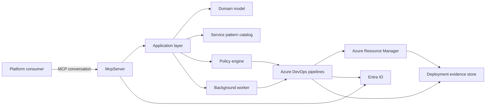
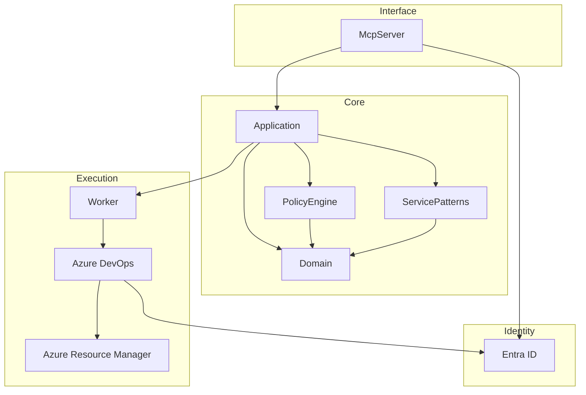

# Architecture overview

Azure Mission Workspace exposes a governed Azure infrastructure fulfillment experience through Model Context Protocol (MCP). The MCP-facing server collects the user intent, resolves an approved service pattern, renders parameters against an environment profile, and then hands execution to Azure DevOps for deterministic validation and deployment. Evidence, approvals, and policy outcomes remain durable artifacts that can be audited after the conversation ends.

## System context

## Component architecture

## Responsibilities

- **McpServer** authenticates callers, preserves the conversational contract, and routes requests into the application layer.
- **Application** orchestrates use cases such as collecting requirements, selecting patterns, rendering parameters, and queuing validation or deployment.
- **Domain** defines durable concepts including deployment requests, evidence, approval state, policy results, and environment profiles.
- **ServicePatterns** stores governed descriptors, input schemas, Bicep entry points, and pattern metadata.
- **PolicyEngine** evaluates normalized plans and deployment evidence against mandatory rules.
- **Worker** executes asynchronous workflow steps that should not block the MCP request/response exchange.
- **Azure DevOps** provides the deterministic validation and deployment control plane with environment approvals.
- **Azure Resource Manager** remains the only authority that changes Azure resource state.
- **Entra ID** issues tokens and supplies actor identity for authorization, auditing, and approval decisions.
