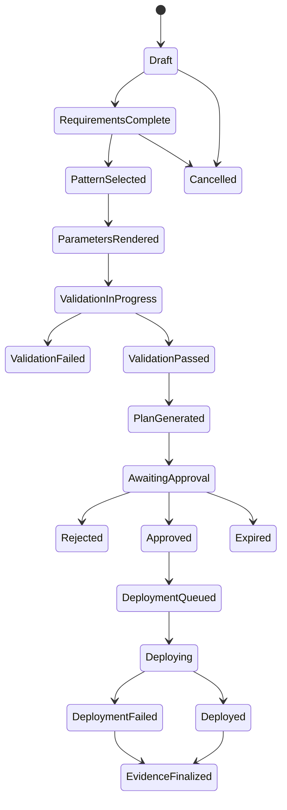
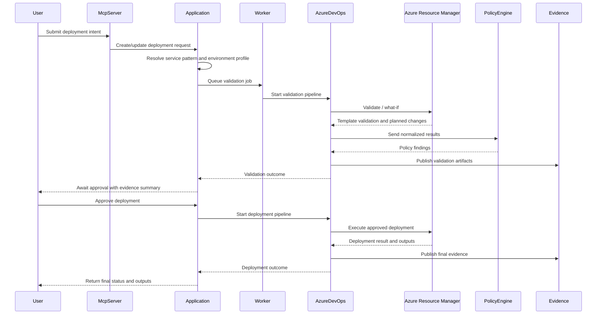

# Deployment lifecycle

Azure Mission Workspace guides a deployment request through a controlled conversational workflow, but execution remains deterministic and policy-driven.

## Sixteen-step workflow

1. A requester describes the mission need through MCP.
2. The application authenticates the caller and opens a draft deployment request.
3. Required business and technical details are collected.
4. The platform narrows the catalog to allowed service patterns for the chosen environment profile.
5. A service pattern is selected and its descriptor is recorded.
6. The input schema is used to validate required and optional parameters.
7. Secret references are captured as Key Vault secret identifiers rather than literal values.
8. The ParameterRenderer produces deterministic `.bicepparam` content.
9. Validation is queued with correlation metadata.
10. Pipelines restore modules, lint, build, validate descriptors, and run tests.
11. ARM validate and what-if produce an execution plan when authenticated validation is available.
12. The policy engine evaluates normalized results and writes policy findings.
13. Evidence artifacts are assembled and the request becomes approval-ready when validation passes.
14. Human approvers review the request, evidence, and risk context.
15. Azure DevOps executes the approved deployment through the declared strategy.
16. Deployment outputs, final evidence, and audit events are published and the request reaches its terminal state.

## Deployment request state machine

Rejected, Cancelled, and Expired are terminal states in this starter -- no further evidence
finalization step is defined for them today, since no deployment attempt or pipeline execution
exists to gather evidence for. Only requests that reach `Deployed` or `DeploymentFailed` (that is,
requests whose approved deployment pipeline actually ran) proceed to `EvidenceFinalized`.

## Validation and deployment sequence

