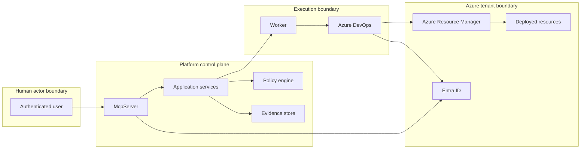

# Security model

Azure Mission Workspace treats the AI conversation as a request capture surface, not as an authorization or deployment authority. Every meaningful security decision is re-evaluated server-side and enforced again during validation and deployment.

## Identity and authentication

- Human users authenticate with **Entra ID**.
- The MCP server validates tokens, resolves tenant context, and records the caller identity on every deployment request.
- Azure DevOps uses a separate workload identity or service connection for deployment execution.
- Approval actions are bound to the original human actor identity and are never substituted by the AI assistant.

## Authorization roles

The platform uses coarse-grained policies that can be mapped to Entra groups or application roles:

- **ServicePatternReader** — browse the catalog and inspect pattern metadata.
- **DeploymentRequestor** — create and update deployment requests for approved service patterns.
- **DeploymentApprover** — approve or reject deployment requests in environments that require human authorization.
- **PlatformEngineer** — maintain service patterns, environment profiles, pipeline templates, and policy logic.
- **PlatformAdministrator** — manage platform-wide settings, identity bindings, and break-glass controls.
- **Auditor** — review evidence, approvals, and audit trails without modifying deployment state.

## Separation of duties

- Requestors cannot self-approve production deployments unless explicitly granted a distinct approver role.
- Pattern authors do not automatically gain runtime deployment privileges.
- Azure DevOps environments provide an independent approval barrier before deployment steps execute.
- Policy evaluation happens before deployment and can block execution even when a request was otherwise approved.

## Secret handling

- Secrets are never collected as free-form conversational data when a Key Vault secret identifier can be used instead.
- Pattern descriptors expose `secretInputs` as references only.
- Parameter rendering resolves secret references at execution time under controlled identity, and evidence stores only references or redacted forms.
- Logs and audit trails should avoid secret values, connection strings, and bearer tokens.

## Human-actor preservation

The platform preserves the identity of the human initiator across the lifecycle:

- `requestedBy` is stamped at creation time.
- approvals record the real approver object ID and timestamp.
- deployment evidence links every transition to a human or workload principal.
- AI-generated suggestions do not replace accountable actors.

## Operational safeguards

- Rate limiting protects the MCP entry point from abusive request floods.
- Standard secure headers should be applied to any HTTP endpoints that back the MCP server.
- Correlation IDs flow through request intake, validation, deployment, and audit events.
- Immutable evidence artifacts help detect post-hoc tampering.

## Trust boundaries

